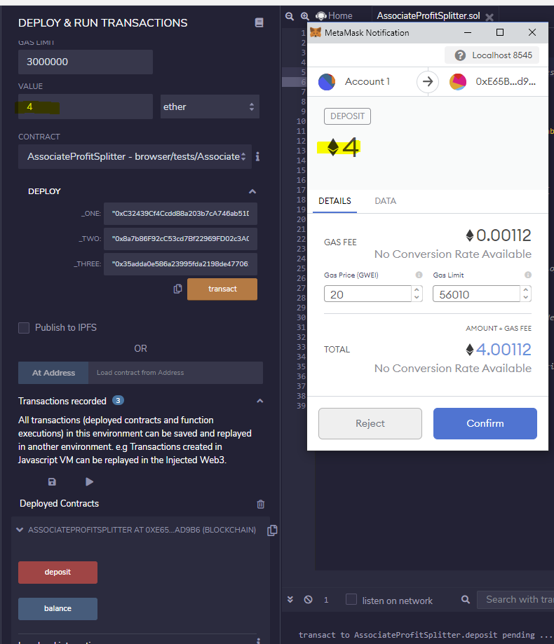

# Unit20_Solidity

# Level 1

## Solidity Code

## Deploy Smart Contract with Ganache Addresses

## Deploy Smart Contract with MetaMask

## Contract Creation Finalized in Ganache

## Execute Smart Contract with 4 Ether

## Execute Smart Contract with MetaMask

## Ganache Final Results
